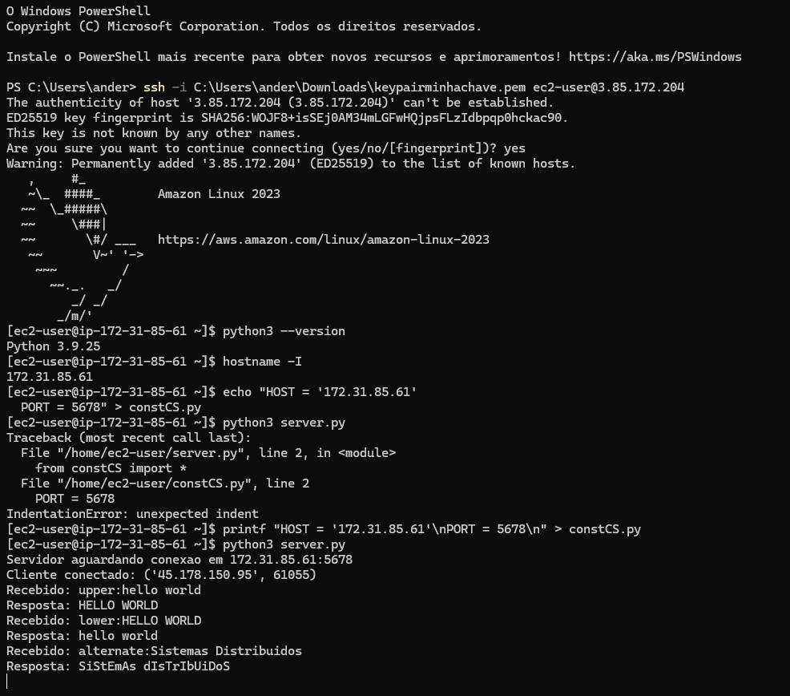

[](https://classroom.github.com/a/7EVNAYx2)
# Servidor de Transformacao de Texto

Sistema cliente-servidor usando sockets TCP, onde o servidor oferece operacoes de transformacao de texto. O servidor roda em uma instancia EC2 na AWS e o cliente conecta remotamente.

## Operacoes disponiveis

O cliente envia requisicoes no formato `operacao:texto` e o servidor processa e retorna o resultado.

- **upper** — converte o texto para letras maiusculas. Ex: `upper:hello world` → `HELLO WORLD`
- **lower** — converte o texto para letras minusculas. Ex: `lower:HELLO WORLD` → `hello world`
- **alternate** — alterna entre maiusculas e minusculas. Ex: `alternate:Sistemas Distribuidos` → `SiStEmAs DiStRiBuIdOs`

O cliente fica em loop, permitindo enviar varias requisicoes diferentes ao servidor em uma mesma conexao. Para encerrar, basta digitar `exit`.

## Como executar

### Servidor (EC2)

```bash
python3 server.py
```

### Cliente (maquina local)

```bash
python client.py
```

O arquivo `constCS.py` contem o IP e a porta usados na comunicacao entre cliente e servidor.

## Teste de funcionamento

A imagem abaixo mostra a conexao SSH com a instancia EC2, o servidor rodando e recebendo requisicoes do cliente com as tres operacoes:


